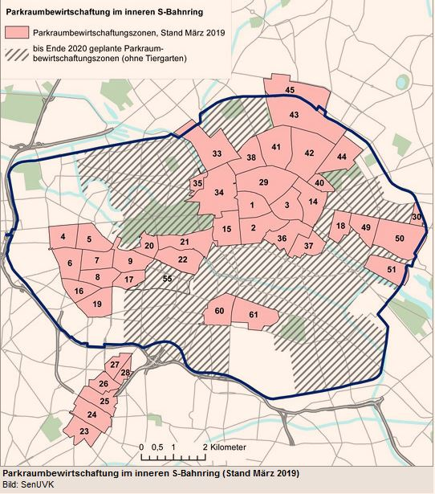
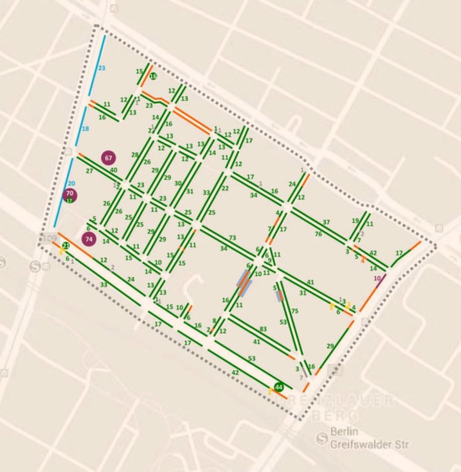
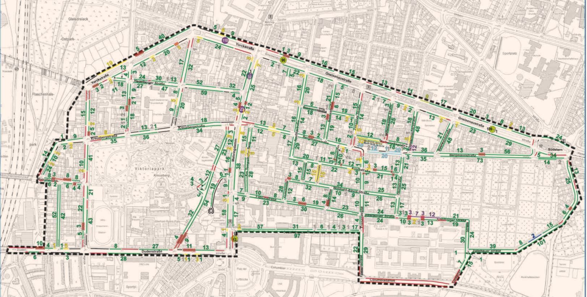
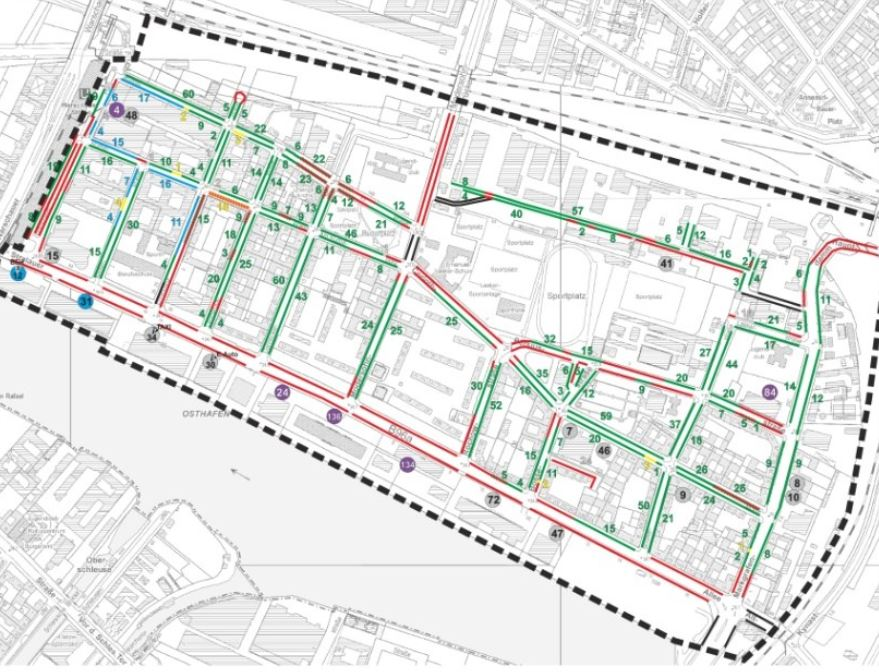
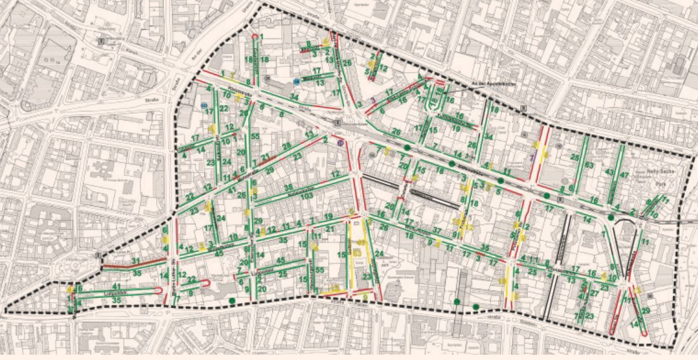

 
# Parkraumangebot/Stellplatzangebot in Berlin
Zumindest für alle Gebiete in Berlin, wo Parkraumbewirtschaftung stattfindet oder bald stattfinden soll, wurden im Rahmen einer Machbarkeitstudie, das Parkraumangebot je Bewirtschaftungszone detailliert erfasst.

## Übersicht:
https://www.berlin.de/hauptstadtluft/luftverbesserung/parkraumbewirtschaftung/
  

## vorhandene Machbareitsstudien / Gutachten
### Pankow:
* https://www.berlin.de/ba-pankow/politik-und-verwaltung/aemter/ordnungsamt/parkraumueberwachung/artikel.437885.php
  

### Fhain-Xberg:
* https://parkeninkreuzberg.de/PDF/180508%20LK%20Argus%20-%20Viktoriapark%20PRB%20Buergerversammlung.pdf
  

* https://docplayer.org/53932889-Parkraumbewirtschaftungskonzept-fuer-das-gebiet-oberbaumcity-rudolfkiez-persiusplatz.html
 

* http://parkeninfhain.de/fileadmin/user_upload/fhain/Parkraumbew_BoxQuartier_Abschlussbericht_1306031_kl.pdf (dead link)

### Charlottenburg:
* https://www.berlin.de/ba-charlottenburg-wilmersdorf/service/formulare/artikel.194652.php

### Schoeneberg:
* https://www.lk-argus.de/downloads/LK-Argus253_PRB_Schoeneberg.pdf
  

## IFG-Anfragen zu  Machbareitsstudien / Gutachten
* Fhain-Xberg: https://fragdenstaat.de/anfrage/gutachten-zu-parkraumbewirtschaftungszonen-des-bezirks/
* Steglitz: https://fragdenstaat.de/anfrage/gutachten-zu-parkraumbewirtschaftungszonen-des-bezirks-steglitz-zehlendorf/
