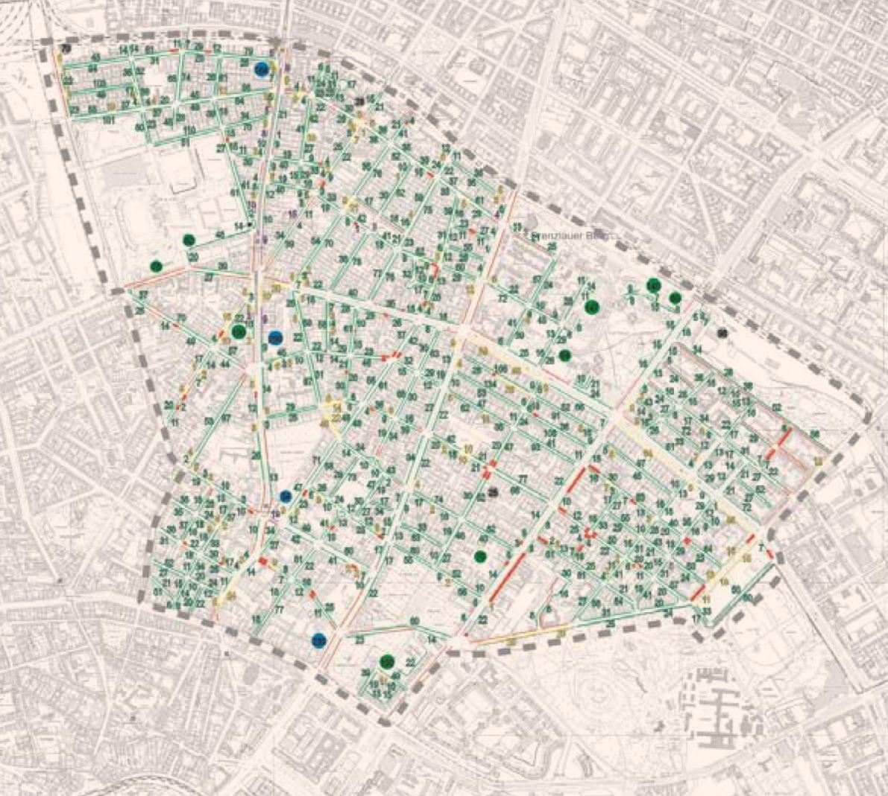
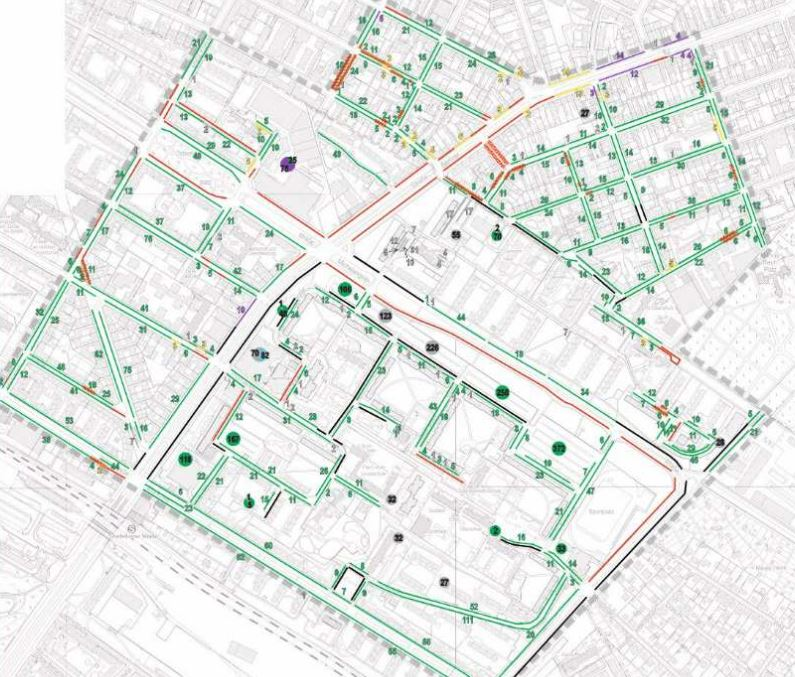
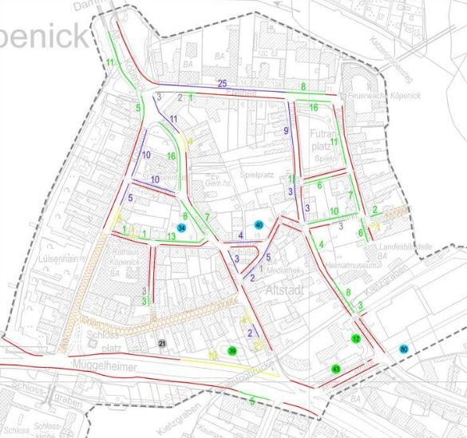
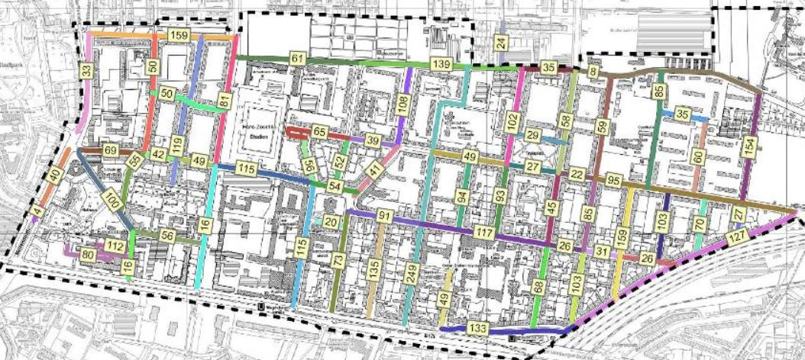

 
# Parkraumangebot/Stellplatzangebot in Berlin
Zumindest für alle Gebiete in Berlin, wo Parkraumbewirtschaftung stattfindet oder bald stattfinden soll, wurden im Rahmen einer Machbarkeitstudie, das Parkraumangebot je Bewirtschaftungszone detailliert erfasst.

## Übersicht:
https://www.berlin.de/hauptstadtluft/luftverbesserung/parkraumbewirtschaftung/
  

## vorhandene Machbarkeitsstudien / Gutachten / Verkehrskonzepte
### Pankow:
* https://www.berlin.de/ba-pankow/politik-und-verwaltung/aemter/ordnungsamt/parkraumueberwachung/artikel.437885.php
  
  

* https://docplayer.org/51150540-Wohnen-an-der-michelangelostrasse.html
  

### Fhain-Xberg:
* https://parkeninkreuzberg.de/PDF/180508%20LK%20Argus%20-%20Viktoriapark%20PRB%20Buergerversammlung.pdf
  

* https://docplayer.org/53932889-Parkraumbewirtschaftungskonzept-fuer-das-gebiet-oberbaumcity-rudolfkiez-persiusplatz.html
 

* http://parkeninfhain.de/fileadmin/user_upload/fhain/Parkraumbew_BoxQuartier_Abschlussbericht_1306031_kl.pdf (dead link)

### Charlottenburg:
* https://www.berlin.de/ba-charlottenburg-wilmersdorf/service/formulare/artikel.194652.php

### Schoeneberg:
* https://www.lk-argus.de/downloads/LK-Argus253_PRB_Schoeneberg.pdf
  

### Köpenick:
* https://docplayer.org/62298033-Untersuchung-zur-parkraumbewirtschaftung.html
  

### Lichtenberg:
https://www.stadtentwicklung.berlin.de/staedtebau/foerderprogramme/stadtumbau/fileadmin/_migrated/content_uploads/111212_Praesentation_Verkehrs-uParkraumkonzept.pdf
  

## IFG-Anfragen zu  Machbarkeitsstudien / Gutachten
* Fhain-Xberg: https://fragdenstaat.de/anfrage/gutachten-zu-parkraumbewirtschaftungszonen-des-bezirks/
* Steglitz: https://fragdenstaat.de/anfrage/gutachten-zu-parkraumbewirtschaftungszonen-des-bezirks-steglitz-zehlendorf/
* Charlottenburg-Wilmersdorf: https://fragdenstaat.de/anfrage/gutachten-zu-parkraumbewirtschaftungszonen-des-bezirks-charlottenburg-wilmersdorf/
* Mitte: https://fragdenstaat.de/anfrage/gutachten-zu-parkraumbewirtschaftungszonen-des-bezirks-mitte/

## Länger zurückligende IFG-Anfragen zu dem Thema
* https://fragdenstaat.de/anfrage/parkraum-in-berlin-anzahl-von-parkplatzen-pro-lor/
* https://fragdenstaat.de/anfrage/parkraum-in-berlin-friedrichshain-kreuzberg-anzahl-von-parkplatzen-pro-lor/
