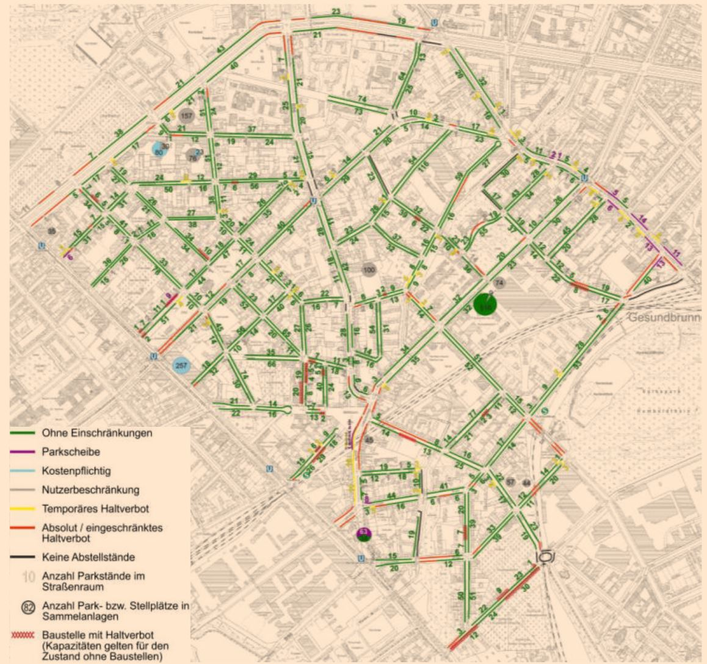

 
# Parkraumangebot/Stellplatzangebot in Berlin
Für alle Gebiete in Berlin, wo Parkraumbewirtschaftung stattfindet oder bald stattfinden soll, wurden im Rahmen einer Machbarkeitstudien, das Parkraumangebot je Bewirtschaftungszone detailliert erfasst. Eine Sammmlung der öffentlichen Studien finden sich hier:

## Übersicht:
https://www.berlin.de/hauptstadtluft/luftverbesserung/parkraumbewirtschaftung/
  

## vorhandene Machbarkeitsstudien / Gutachten
### Pankow:
* https://www.berlin.de/ba-pankow/politik-und-verwaltung/aemter/ordnungsamt/parkraumueberwachung/artikel.437885.php
  

### Fhain-Xberg:
* https://parkeninkreuzberg.de/PDF/180508%20LK%20Argus%20-%20Viktoriapark%20PRB%20Buergerversammlung.pdf
  

* http://parkeninfhain.de/fileadmin/user_upload/PDF/151209_LK_Argus_-_Oberbaumcity_PRB_Endbericht.pdf (dead link)
* http://parkeninfhain.de/fileadmin/user_upload/fhain/Parkraumbew_BoxQuartier_Abschlussbericht_1306031_kl.pdf (dead link)

### Charlottenburg-Wilmersdorf:
* https://www.berlin.de/ba-charlottenburg-wilmersdorf/service/formulare/artikel.194652.php

### Tempelhof-Schöneberg:
* https://www.lk-argus.de/downloads/LK-Argus253_PRB_Schoeneberg.pdf
  

### Mitte
* http://www.pankstrasse-quartier.de/images/Projekte/2016-18_Verkehrskonzept/Abschlussbericht_Verkehrskonzept_-_Pankstra%C3%9Fe_QM.pdf
  

## IFG-Anfragen zu Machbarkeitsstudien / Gutachten
* Fhain-Xberg:  
  https://fragdenstaat.de/anfrage/gutachten-zu-parkraumbewirtschaftungszonen-des-bezirks/
* Steglitz:  
  https://fragdenstaat.de/anfrage/gutachten-zu-parkraumbewirtschaftungszonen-des-bezirks-steglitz-zehlendorf/
* Charlottenburg-Wilmersdorf:  
  https://fragdenstaat.de/anfrage/gutachten-zu-parkraumbewirtschaftungszonen-des-bezirks-charlottenburg-wilmersdorf/  
* Mitte:  
  https://fragdenstaat.de/anfrage/gutachten-zu-parkraumbewirtschaftungszonen-des-bezirks-mitte/
